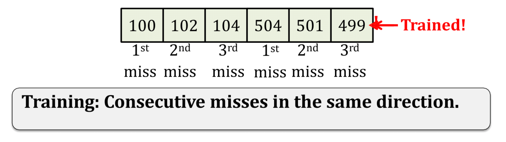

# Lab-4 ChampSim

## Part I : Replacement Policies
In this part we will be implementing replacement policies and comparing them

- **LRU (Least Recently Used)** : Already implemented in the provided ChampSim
- **FIFO (First In First Out)** :  In this replacement policy, when the cache becomes full we evict the oldest cache block in the set
- **LFU (Least Frequently Used)** : We evict the cache line that is least frequently used, where frequency stands for the number of times the cache line is accessed(this could mean both read/write)
- **BIP (Binary Insertion Policy)** : Cache lines are inserted in _MRU_ position with some probability $\epsilon$ and in _LRU_ position with probability $1-\epsilon$. Cache lines in _LRU_ position are promoted to _MRU_ position only if they are accessed while being in _LRU_ position. Any line in _LRU_ position is evicted to make space for incoming line. For more details go through [this](https://www.cs.cmu.edu/afs/cs/academic/class/15740-f18/www/papers/isca07-qureshi-dip.pdf). Run it with $\epsilon = 0, \frac{1}{4}, \frac{1}{2}, \frac{3}{4}, 1$.

All the policies are to be used for L2C cache

### Comparison of Replacement Policies
We will be comparing `IPC`, `L2C Miss Rate` of these replacement policies for `L2C` cache. 

Plot the `IPC` and `L2C Miss Rate` values for different policies and traces. Use a multi-bar chart. Write your reasoning for the variations in these values in the report.

## Part II : Data Prefetcher

We will be implementing Stream Prefetcher in this part.

It works as follows:
1. The first miss, say to cache line `X`,
initiates a stream.
2. the second miss to cache line `X+Y` (or `X-Y`).
defines the direction of the stream in this case
3. The third miss, at `X+Z` (or `X-Z`) (where `Z>Y`), confirms the direction. Here `Z<PREFETCH_DISTANCE`.

- If X -> X+Y -> X+Z set stream direction as 1
- If X -> X-Y -> X-Z set stream direction as -1

Now we mark `X` as `start_addr` and `X+stream_dirn*PREFETCH_DISTANCE` as `end_addr`. This forms a monitoring region between either (`start_addr`, `end_addr`) or (`end_addr`, `start_addr`). Whenever we get miss in this monitoring region, we prefetch lines `end_addr+1`, `end_addr+2`, ... `end_addr+PREFETCH_DEGREE` or `end_addr-1`, `end_addr-2`, ... `end_addr-PREFETCH_DEGREE` depending on the stream direction. Also now we move monitoring region to either (`start_addr+PREFETCH_DEGREE`, `end_addr+PREFETCH_DEGREE`) or (`end_addr-PREFETCH_DEGREE`, `start_addr-PREFETCH_DEGREE`) depending on stream direction.

In short, after getting miss in the monitoring region
1. Prefetch lines `end_addr+stream_dirn*1`, `end_addr+stream_dirn*2`, ... `end_addr+stream_dirn*PREFETCH_DEGREE`
2. Move monitoring region as `start_addr += stream_dirn*PREFETCH_DEGREE` and `end_addr += stream_dirn*PREFETCH_DEGREE`

Maintain these monitoring regions in a table. When table gets filled and you need to evict one of the monitoring regions, use LRU policy to do so. Keep size of the table as 64.

Compare Stream Prefetcher with IP Stride prefetcher which is already implemented in the ChampSim provided. Both the prefetchers should be working at **L2** level.

Compare these prefetcher on following metrics:
- Speedup
- L2C Load MPKI
- L1D MPKI

Plot bar graphs for each one of the above metrics

### Traces
Use the following [traces](https://drive.google.com/drive/folders/1BE4XkJhgXWZ6JOIByQCMF_4cFSvlb3f1?usp=sharing) for the simulations for above questions

To speedup simulation, run them parallely. You can use `multiprocessing` module of python to do this.

**Simulations should be done with `25M` Warmup and `25M` Simulation instructions**

## Submission
Submit only the following files:
- `FIFO.cc`
- `LFU.cc`
- `BIP.cc`
- `stream_prefetcher.cc`
- `report.pdf`
- `*.cc` (if you have implemented apart from these)

### Important Note
Unlike previous labs, in this part you are free to experiment and come up with improvements. It's completetly fine if you don't get improvements. You should mention what you tried in the report.